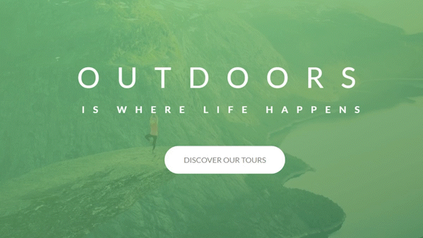
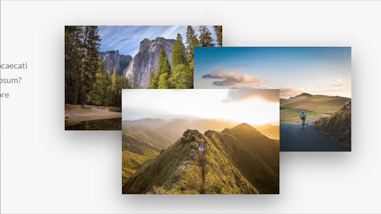
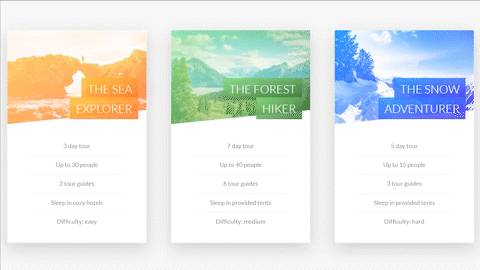
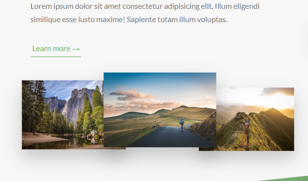
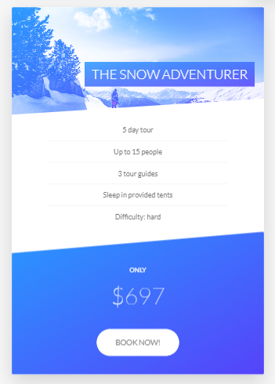
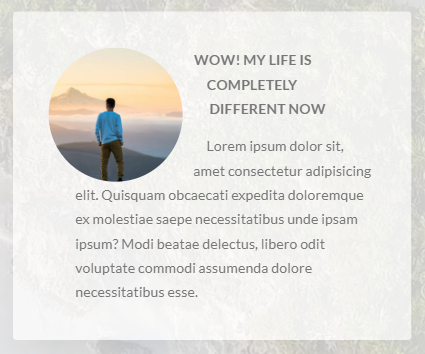

<!-- PROJECT LOGO -->

<p align="center">
  <a href="https://stekatag.github.io/natours/">
    
  </a>

  <h3 align="center">Natours</h3>

  <p align="center">
    A mockup landing page for a travel agency startup.
    <br />
    <a href="#about-the-project"><strong>Explore the docs »</strong></a>
    <br />
    <br />
    <a href="https://stekatag.github.io/natours/">View Demo</a>
    ·
    <a href="https://github.com/stekatag/natours/issues">Report Bug</a>
    ·
    <a href="https://github.com/stekatag/natours/issues">Request Feature</a>
  </p>
</p>

<!-- TABLE OF CONTENT -->

<!-- TABLE OF CONTENTS -->
<details open="open">
  <summary>Table of Contents</summary>
  <ol>
    <li>
      <a href="#about-the-project">About The Project</a>
      <ul>
        <li><a href="#goals-of-the-project">Goals of the project</a></li>
      </ul>
    </li>
    <li>
      <a href="#features">Features</a>
      <ul>
        <li><a href="#keyframes-animations">@keyframes animations</a></li>
        <li><a href="#image-transitions">Image Transitions</a></li>
        <li><a href="#card-animations">Card animations</a></li>
        <li><a href="#stories-section">Stories section</a></li>
      </ul>
    </li>
    <li>
      <a href="#responsive-design">Responsive design</a>
      <ul>
      <li><a href="#key-feature-differences-from-desktop-app">Key Feature Differences from Desktop App</a></li>
      </ul>
    </li>
    <li><a href="#built-with">Built With</a></li>
    <li>
      <a href="#getting-started">Getting Started</a>
      <ul>
        <li><a href="#prerequisites">Prerequisites</a></li>
        <li><a href="#installation">Installation</a></li>
      </ul>
    </li>
    <li><a href="#roadmap">Roadmap</a></li>
    <li><a href="#contributing">Contributing</a></li>
    <li><a href="#license">License</a></li>
  </ol>
</details>

<!-- ABOUT THE PROJECT -->

## About The Project

[![Product Name Screen Shot][product-screenshot]](https://stekatag.github.io/natours/)

[product-screenshot]: ./img/product-screenshot.jpg/

A project from the _Advanced CSS and Sass_ course by Jonas Schmedtmann. The project is a mockup landing page for a travel agency startup. It is built with HTML, CSS, and Sass.

### Goals of the project

1. Be up to speed with the most modern and advanced CSS properties and techniques;
2. Be ready to build responsive layouts for all kinds of devices and situations;
3. Truly understand how CSS works behind the scenes;
4. Be able to architect large CSS codebases for reusability and maintainability using Sass.

## Features

### `@keyframes` animations

This feature allows for elements to transition from one position to another. This is achieved by defining where elements are positioned at the beginning and at the end of the animation.

<p align="center">
    
</p>

### Image Transitions

Each image is emphasized as it's hovered over giving a 3D feel to the webpage. This is achieved by scaling up the current image being hovered over and scale-down the other photos.

<p align="center">
    
</p>

### Card Animations

Probably my favorite feature of this page. This card animation is achieved by creating two div elements, front-side, and back-side styled to be on top of each other achieved by the property `backface-visibility: hidden` and then giving each side its own styling accordingly. This segment of this page also reuses the button component similar to the "Discover our tours" button at the top of the page.

<p align="center">
    
</p>

### Stories Section

This landing page also features a stories section where people review their experiences of the tours. The main highlights of this page is the background video (for this entire section), the container of the review being skewed into a parallelogram shape, and how the text _wraps_ around the shape of the image.

<p align="center">
    
</p>

The background video styling is achieved by position the video element absolute, relative to its parent container. It was also given a relatively low z-index and a slightly lower opacity to give it a blur effect. Lastly, it was given a object-fit property of cover to make sure that the video's aspect ratio is kept.

<p align="center">
    
</p>

For the main content of this features section, we can see that the container is skewed into a parallelogram shape, and the text _wraps_ around the image. The parallelogram shape of background of the container is achieved by skewing it by x degrees (in this case -12 degrees as seen below), and making sure that the rest of the contents inside of the container itself is skewed 12 degrees (opposite of its parent container).

Now the _wrapping around_ of the text to the shape of the image is achieved by using CSS propert called, `shape-outside` and giving its specified values. Note however, that this will only work if the element has defined dimensions (width and height as seen on the code below).

```scss
.story {
  transform: skewX(-12deg);

  &__shape {
    width: 15rem;
    height: 15rem;
    float: left;
    // shape outside only works if the element has a property of float, width and height
    -webkit-shape-outside: circle(50% at 50% 50%);
    shape-outside: circle(50% at 50% 50%);
    -webkit-clip-path: circle(50% at 50% 50%);
    clip-path: circle(50% at 50% 50%);
    transform: translateX(-3rem) skewX(12deg);
  }
}
```

## Responsive Design

This page also utilizes a responsive design to provide seamless user-experience to all users across all devices. This is achieved by utilizing a `mixin` where it takes in a breakpoint and with that, determins the max-width of the current viewport the app is being viewed from.

```scss
@mixin respond($breakpoint) {
  @if $breakpoint == phone {
    @media (max-width: 37.5em) {
      @content;
    } // 600px
  }

  @if $breakpoint == tab-port {
    @media (max-width: 56.25em) {
      @content;
    } // 900px
  }

  @if $breakpoint == tab-land {
    @media (max-width: 75em) {
      @content;
    } // 1200px
  }

  @if $breakpoint == big-desktop {
    @media (min-width: 112.5em) {
      @content;
    } // 1800px
  }
}
```

### Key Feature Differences from Desktop App

#### Images

Images are aligned differently in tablet/mobile screens. Instead of being aligned in a row, they are aligned in a column.

<p >
    
</p>

#### Cards

Since there is no cursor on mobile devices, the card animation is not possible. Instead, the card is just a static image.

<p >
    
</p>

#### Features

<p >
    
</p>

## Built With

This app is built with Vanilla JavaScript, HTML and Sass. It's using Parcel as module bundler and NPM as package manager.

- [HTML](https://developer.mozilla.org/en-US/docs/Web/HTML)
- [SCSS](https://sass-lang.com/)
- [JavaScript](https://developer.mozilla.org/en-US/docs/Web/javascript)
- [NPM](https://www.npmjs.com/)

<!-- GETTING STARTED -->

## Getting Started

To get started with project just simply fork this repo or download locally on your System.

To get a local copy up and running follow these simple example steps.

### Prerequisites

Start with the latest version of NPM to avoid any errors:

- npm
  ```sh
  npm install npm@latest -g
  ```

### Installation

1. Clone the repo
   ```sh
   git clone https://github.com/stekatag/natours.git
   ```
2. Install NPM packages

   ```sh
   npm install
   ```

<!-- ROADMAP -->

## Roadmap

See the [open issues](https://github.com/stekatag/natours/issues) for a list of proposed features (and known issues).

<!-- CONTRIBUTING -->

## Contributing

Contributions are what make the open source community such an amazing place to be learn, inspire, and create. Any contributions you make are **greatly appreciated**.

1. Fork the Project
2. Create your Feature Branch (`git checkout -b feature/AwesomeNewFeature`)
3. Commit your Changes (`git commit -m 'Add some AwesomeNewFeature'`)
4. Push to the Branch (`git push origin feature/AwesomeNewFeature`)
5. Open a Pull Request

<!-- LICENSE -->

## License

Distributed under the MIT License. See [license](./LICENSE.txt) for more information.
